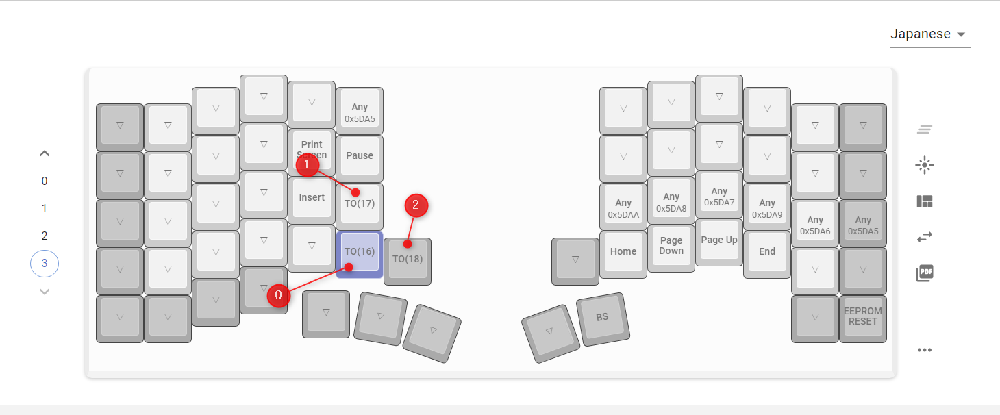
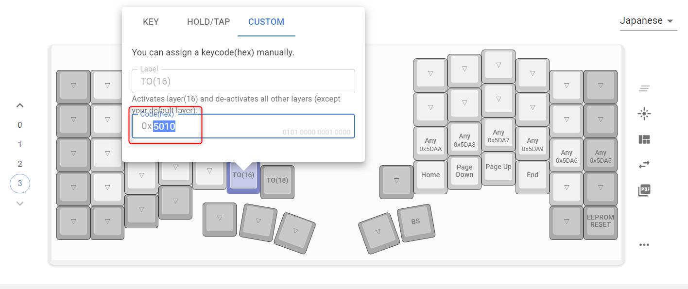
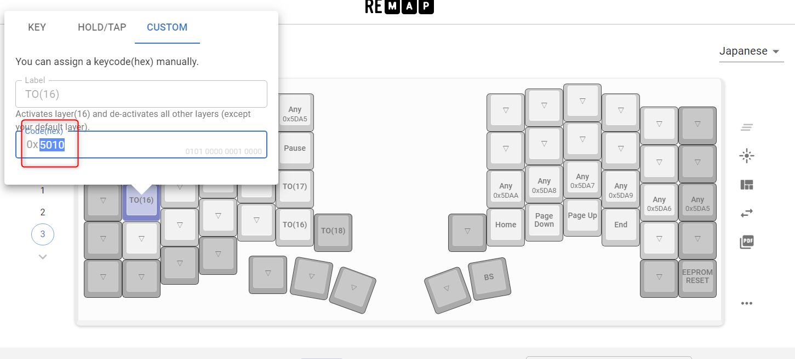

# keyball

Keyball is split keyboard has 100% track ball

## Firmware build guide

Keyball46 have separate firmwares for each of PCBs w/ trackball and w/o
trackball.  You can build those with this commands in root of QMK firmware
source tree.

```console
$ make keyball/rev1/ball:via
$ make keyball/rev1/noball:via
```

You will get two files:

* `keyball_rev1_ball_via.hex` - Trackball PCB firmware with VIA support.
* `keyball_rev1_noball_via.hex` - No trackball PCB firmware with VIA support.

Write each firmwares to correct PCB's Pro Micro.

In generally, you can build fimwares with this command.

```console
$ make keyball/rev1/ball:{YOUR_FAVORITE_KEYMAP}
$ make keyball/rev1/noball:{YOUR_FAVORITE_KEYMAP}
```

### Keyamaps

Keyball46 provides some keymaps as default:

* `via` - VIA support, trackball is on right side
* `via_Left` - VIA support, trackball is on left side
* `test` - Test for building/soldering Keyball46 (w/ right trackball)
* `default` - Template for customized keymap (w/ right trackball)

### Prerequirements to build firmware

1. Checkout [QMK firmware source codes](https://github.com/qmk/qmk_firmware)
2. Setup QMK correctly ([See also](https://beta.docs.qmk.fm/tutorial/newbs_getting_started))
3. Copy `./qmk_firmware/keyboards/keyball/` directory in this repository to QMK firmware's dir as `{QMK_FIRMWARE_ROOT}/keyboards/keyball`.
4. Build Keyball46 firmwares (See above section)

    ```console
    $ make keyball/rev1/ball:via
    $ make keyball/rev1/noball:via
    ```

## Remapでのレイヤ設定について
Remapで設定を変更する際に普通にやると多分レイヤとLEDの色は連動しません。(むしろ普通にTO(0)とかで設定しても多分レイヤが移動しません。)

Remapの設定で色の連動をさせるためには画像を参考に設定してみてください。
1. QMK Firmwareで設定したレイヤ番号とRemap上での表示の違いを確認する。 ※EEPROMリセットをしないとQMK Firmwareで書き込んだキーマップが反映されないかもしれません。おかしいと思ったらESCキーを押しながらUSBを指すか設定されているキーを押してEEPROMリセットを試してみてください。

実際のキーマップ
```
[3] = LAYOUT_universal(
   _______ , _______ , _______ , _______ , _______  , KBC_RST  ,                                  _______  , _______  , _______  , _______  , _______  , _______  ,
   _______ , _______ , _______ , _______ , KC_PSCR  , KC_PAUS  ,                                  _______  , _______  , _______  , _______  , _______  , _______  ,
   _______ , _______ , _______ , _______ , KC_INS   , TO(1)    ,                                  CPI_D1K  , CPI_D100 , CPI_I100 , CPI_I1K  , KBC_SAVE , KBC_RST  ,
   _______ , _______ , _______ , _______ , _______  , TO(0)    ,   TO(2)  ,            _______  , KC_HOME  , KC_PGDN  , KC_PGUP  , KC_END   , _______  , _______  ,
   _______ , _______ , _______ , _______ , _______  , _______  , _______  ,            _______  , KC_BSPC  , _______  , _______  , _______  , _______  , EEP_RST
```

2. レイヤ変更のキーをクリックしてHexコードを確認する


3. 設定したいキーにHexコードを設定する


4. Flashして動作を確認する。

その他注意点として、`qmk_firmware/keyboards/keyball/lib/keyball/keyball.h`の設定も変更していますので注意してください。

## カーソルの移動量と移動数のカウントについて
トラックボールの移動量はCPI 500の設定ですと、軽くトラックボールを動かした程度で10以下、少し勢いをつけて動かすと20程度になっています。

この距離を元にレイヤを動かすか判定しています。

また、軽く指が触れてしまった程度でレイヤが動いてしまうと困るため、一定の距離を移動した回数が一定の回数を超えたらレイヤが切り替わるようにしています。

この一定のしきい値をキーボード上で変更できるようにしてあります。

|  Value      | Keycode    | Description               |
|-------------|---------------------------|---------------------------|
|  ``0x5DAF`` | ``THR_U``   | 移動量のしきい値を1上げます。最大100      |
|  ``0x5DB0`` | ``THR_D``   | 移動量のしきい値を1下げます。最小1        |
|  ``0x5DB1`` | ``COUNT_U`` | レイヤ変更までのカウント数を1上げます。最大100 |
|  ``0x5DB2`` | ``COUNT_D`` | レイヤ変更までのカウント数を1下げます。最小1   |

上記表に記載されているキーを押すとOLED上の現在の設定値が変わります。
```
Co  [現在のカウント数]  M [移動量の設定値] C  [カウント数の設定値]
```
上記の情報を元に設定を調整してご操作でレイヤが変わってしまわないように調整してください。

ただし、この設定は``KBC_SAVE``での保存には対応していないため、USBを抜いたりすると初期値の10に戻ってしまいます。そのため、何処かにメモしておく必要があります。

また、ビルド済みのhexファイルも今回追加しました。（[ファームウェア](./builded-firmware/keyball_keyball61_tomiku.hex)）

以上になりますが、ご質問等ありましたら<a href="https://twitter.com/tomiku8" target="_blank">@tomiku8</a>まで。